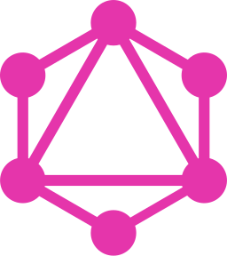

<h1 align="left" id="phreakphreak-title">:wave: Hello there! I'm Michael Zabala</h1>
<h3 align="left">I am a Full Stack Developer </h3>

  

- :seedling: &nbsp;I’m currently learning **Go**
- :speech_balloon: &nbsp;I like to talk about **javascript** and **Pentesting**
- :mailbox: &nbsp;Ask me anything on my **[issues page]**
- :computer: &nbsp;Connect with me on **[LinkedIn]**

 

<h2 align="left" id="phreakphreak-tech">Favorite Tech</h2>

> Tools, languages, and other things that I like to work with.

<table>
  <tr>
    <td align="center" width="96">
      
       JavaScript
    </td>
    <td align="center" width="96">
      
       TypeScript
    </td>
    <td align="center" width="96">
      
       React
    </td>   
    <td align="center" width="96">
      
       Next.js
    </td>
    <td align="center" width="96">
      
       TailwindCSS
    </td>
    <td align="center" width="96">
      
       HTML5
    </td>
    <td align="center" width="96">
      
       CSS
    </td>
  </tr>

<tr>
    <td align="center" width="96">
      
       Node
    </td>
<td align="center" class="square" width="96">
      
       Express
    </td>
    <td align="center" width="96">
      
       Webpack
    </td>
    <td align="center" width="96">
      
       Deno
    </td>
  <td align="center" width="96">
      
       Git
    </td>
<td align="center" width="96">
      
       GraphQL
    </td>
<td align="center" width="96"> 
      
       Docker
    </td>
</tr>

  <tr>
    <td align="center" width="96">
      
       Python
    </td>
    <td align="center" width="96">
      
       Go
    </td>
    <td align="center" width="96">
      
       C#&nbsp;(Core)
    </td>
    <td align="center"  width="96">
      
       MongoDB
    </td>
    <td align="center"  width="96">
      
       MySQL
    </td>
<td align="center" width="96"> 
      
       Arch Linux
    </td>
    <td align="center" width="96"> 
      
       Debian
    </td>
  </tr>
</table>

<!-- links -->

[issues page]: https://github.com/phreakphreak/phreakphreak/issues "phreakphreak/issues"
[linkedin]: https://www.linkedin.com/in/phreakphreak/ "Michael Zabala LinkedIn"
